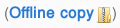

# Grav Shortcode Offline Copy Plugin

`shortcode-offline-copy` is a [Grav][grav] Plugin to reference a local copy
of an asset.

# Installation

To install this plugin, just download the zip version of this repository and
unzip it under `/your/site/grav/user/plugins`.
Then, rename the folder to `shortcode-offline-copy`.

You should now have all the plugin files under

  /your/site/grav/user/plugins/shortcode-offline-copy

# Usage for content authors

To use this plugin insert in any page the following tag:

    [shortcode-offline-copy]your-filename.pdf[/shortcode-offline-copy]

    [shortcode-offline-copy]your-filename.zip[/shortcode-offline-copy]

[grav]: http://github.com/getgrav/grav
